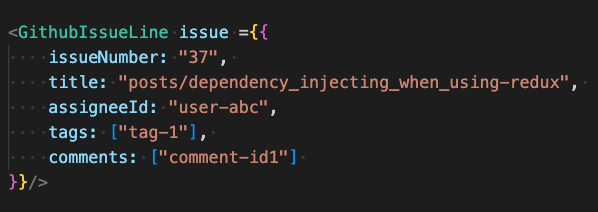

# Testing strategies for SPAs involving state management. 

In my experience it is the presence of global state management that causes the most difficulty when it comes to testing React applications. 

## Tooling 

There are three kinds of environments that we might write tests:

- Jest/RTL/JSDOM 

- Storybook

- Cypress/Playwright
  - E2E tests against a deployed application
  - Component tests


## Some disparate caveats and philosophies


**1. Writing new code to be testable, and writing tests for an existing codebase with low test coverage are two completely different practices**

It's worth keeping in mind that if you're reading an article on 'here's how to write testable' code, as sound and useful as the advice might be, it may be only useful within the context of if you were creating a new project/new module. 

Writing tests for some existing, untested code, shouldn't involve (or in practise, should minimise) any 'we need to rewrite the code in order to test it'. 

An example of how this distinction might play out, is I would generally give the advice that you shouldn't rely on module mocking as your testing strategy, and you should prefer dependency injection instead (more on this later). However, module mocking can be very a powerful tool in testing a codebase that hasn't implemented a dependency injection pattern. 


**2. Developers will copy what they already see in the codebase**

As a general philosophy for all software development, developers are going to continue with the patterns they already see in the codebase. Questions like 'how do I get this thing from state?' or 'How do I interact with this button in a test?' they'll look at what other code has done, and copy that, and continue to copy that as long as it is being effective in getting their job done. 


**3. It's easier to write tests if the existing test infrastructure is already set up**. 

Some testing strategies (eg. using MSW) may involve creating large amounts of boilerplate and/or test data, and once this is done writing tests might be somewhat easy. 

But in an untested codebase, creating this large amount of test data and boilerplate maybe an unpalatable and daunting proposition. 

**4. We're talking about a REST API here**

Some of the problems I'll mentioned may be solved with GraphQL. However let's just assume that we have a REST API and we're not about change that. 

**5. The industry needs to do a better job writing documentation for how to write tests for code using their frameworks.**

TanStack [does have a dedicated testing section in their docs](https://tanstack.com/query/latest/docs/react/guides/testing). [Permalink](https://web.archive.org/web/20230926233441/https://tanstack.com/query/latest/docs/react/guides/testing). 


**6. If I had a codebase with zero tests, I would start with end-to-end tests**

E2E tests serve as an implicit test of a bunch of functionality, giving you test coverage of a lot of surface area quickly. 

**7. Any technical strategy is going to vary on business context**

There's a big difference in what your testing strategy will be for a mature 200 person organisation, vs a five person start up vs a 10,000 person multinational. 

**8. Renders - worth mentioning but also maybe it doesn't matter**

(TODO)

## The application we are testing

Let's take an application like Github. For the purposes of this exercise, let's ignore all of the git operations involved, which is not something I have given much thought to, and we'll assume that it's otherwise a CRUD app.

When we create an issue or view, here are some of the user interactions available to us. 

- When creating an issue there is a title and body textfield to be filled
- The body textfield needs to respond to keyboard shortcuts
- The body textfield needs to respond to pasting files/images in
- In the body textfield if we type `#` it gives us a selector to select other issues/pull requests
- In the body textfield if we type `@` it gives us a selector to select users.
- On the right hand panel we can assign users, projects, labels etc. 

Clearly a non-trivial application, and that kind of thing that we really do want some automated tests on. 

## How the state management tools suggest you test

The state management library commonly recommend using MSW to Mock API calls, and state that you should include the logic of your state management layer within the unit under test. 

See: 

- [TK Dodo's Blog](https://tkdodo.eu/blog/testing-react-query)  (Permalink)(https://web.archive.org/web/20230926234138/https://tkdodo.eu/blog/testing-react-query)

- [Redux docs](https://redux.js.org/usage/writing-tests) 

>Prefer writing integration tests with everything working together. For a React app using Redux, render a \<Provider\> with a real store instance wrapping the components being tested. Interactions with the page being tested should use real Redux logic, with API calls mocked out so app code doesn't have to change, and assert that the UI is updated appropriately.

>Do not try to mock selector functions or the React-Redux hooks! Mocking imports from libraries is fragile, and doesn't give you confidence that your actual app code is working.

To be clear - I think the reasoning here is sound - often what we want when it comes to testing, isn't just 'when this data exists' - we also want to see the behaviour while the data is loading, etc. 

So here's how this might look: 

(Image)

And with MSW mocking

```jsx
import { rest } from 'msw'
import { setupServer } from 'msw/node'

const server = setupServer(
  // Describe the requests to mock.
  rest.get('/users', (req, res, ctx) => {
    return res(
      ctx.json([{
            userId: "1", 
            name: "Fooby"
        }]
    ))
  }),
)

beforeAll(() => {
  server.listen()
})

afterAll(() => {
  server.close()
})
describe(GithubMarkdownEditor, () => {

    it("pressing @ will open the users menu", () => {
        render(<GithubMarkdownEditor/>);
        userEvent.type(screen.getByRole("textbox"), "@"); 
        expect(...)
    })   
})
```

## One improvement/amendment - MSW not necessary - Service injection instead

One thing I might suggest, is that instead of using MSW to mock API endpoints, we use service functions that we provide via what I call a service injection pattern. 


ie. instead of something like: 

```typescript 
//services/users.ts
async function getUsers() {
    // But actually, we have more logic here re: authentication refresh, headers etc
    return fetch('/users'); 
}


// serviceHooks/users.ts
import {getUsers} from "services/users";
function useUsers() {
    return useQuery({
        queryKeys: ['users'], 
        queryFn: async () => {
            const result = await getUsers(); 
            return result; 
        }
    })
}

```

We do this: 


```typescript 
//services/users.ts

// Untouched 
async function getUsers() {
    return fetch('/users'); 
}


// serviceHooks/users.ts
function useUsers() {
    // Rather than importing getUsers directly 
    // We get it from context
    const {getUsers} = useServices(); 
    return useQuery({
        queryKeys: ['users'], 
        queryFn: async () => {
            const result = await getUsers(); 
            return result; 
        }
    })
}

// providers/ServiceProvider 
import React, { PropsWithChildren } from "react";
import * as allServices from "../services/index";

export type AllServices = typeof allServices;

// Default behaviour is that each of the services just throw an error
const DEFAULT_SERVICES = Object.keys(allServices).reduce((acc, cur) => {
    acc[cur as keyof AllServices] = () => {
        throw new Error(`${cur} service not provided`)
    }
    return acc;
}, {} as AllServices)

const ServiceProviderContext = React.createContext(DEFAULT_SERVICES);

/**
 * We can choose to instantiate the services with our own overrides, for testing
 */
export function ServiceProvider(props: PropsWithChildren<Partial<AllServices>>) {
    const { children, ...rest } = props;
    return <ServiceProviderContext.Provider value={{
        ...allServices,
        ...rest
    }}>
        {props.children}
    </ServiceProviderContext.Provider>
}
export const useServices = () => {
    return React.useContext(ServiceProviderContext);
};

// App.tsx
import * as allServices from "../services/index";

export function App() {
    // In production we use the real services
    return <ServiceProvider {...allServices}>
        <RestOfTheApp/>
    </ServiceProvider>
}

```


And then we'd have a test like: 

```typescript
describe("Some Component", () => {
    it("Happy path", () => {
        render(<ServiceProvider getUsers={async () => {
            return [ 
                {
                    userId: "1", 
                    name: "Fooby"
                }
            ]   
        }}>
            <SomeComponent/>
        </ServiceProvider>);
    })
})
```

For configuring Redux to accept dependency injection, see this [thread here](https://www.reddit.com/r/reactjs/comments/13vyitw/dependency_injection_into_rtk_query_createapi/).  [Permalink](https://web.archive.org/web/20230927003644/https://www.reddit.com/r/reactjs/comments/13vyitw/dependency_injection_into_rtk_query_createapi/?rdt=40091)


In my opinion this is less cumbersome than setting up MSW and we get the advantages of the TypeScript providing hints at what the return value of each of our service functions should be. 

Of course, caveat #1 applies here, if we didn't already have code configured, this this pattern might not work, and that's where MSW could be a very powerful tool. 

## What about for a more complicated state management? 

Whether you use a tool like MSW or you use a service injection pattern, the picture we've currently got is a nice simple blue sky. 

Let's say we're building that markdown editor for Github and we've got something like this

```typescript 
function GithubMarkdownEditor(props) {

    const availableUsersResult = useUsers(); 
    const availableIssuesAndPrsResult = useIssuesAndPrs();
    const addFileToMarkdown = useAddFileToMarkdown(); 


    return <>
        implementation here 
    </>
}
```

And we'd write our test like: 

```jsx
describe(GithubMarkdownEditor, () => {
    it("pressing @ will open the users menu", () => {
        render(<ServiceProvider getUsers={async () => {
            return [ 
                {
                    userId: "1", 
                    name: "Fooby"
                }
            ];    
            }}
            getPrsAndIssues={async () => {
            return [ 
            ];    
            }}
            >
            <GithubMarkdownEditor/>
        </ServiceProvider>);

        userEvent.type(screen.getByRole("textbox"), "@"); 
        expect(...)
    })   
})

```

But what if our state management is more convoluted? 

What if the state management more looked like this? 

(Image) 

What if the bit of state management that got the available users looked more like: 

```typescript
function useUsers(projectId: string) {

    const {getUsers} = useServices(); 

    const getProjectLazy = useProjectLazy(); // State management hook, comes from GET /project/{id}
    const exclusionTags = useExclusionTags();  //State management hook, comes from GET /settings/exclusion-tags 
    return useQuery({
        queryKeys: ['users'], 
        queryFn: async () => {
            
            const project = await getProjectLazy(projectId); 
            const projectTags = project.tags; 
            const projectSubProjects = project.subProjects; 

            // Also need to fetch the sub projects to find their tags
            const otherProjects = Promise.all(projectSubProjects.map((v) => v.getProjectLazy(v))); 

            // Put into one list and dedupe
            const allTags = [...otherProjects.flatMap((v) => v.tags), ...projectTags];
            const allTagsDeduped = [...new Set(allTags)]; 

            // Filter out the exclusion tags
            const filteredTags = allTagsDeduped.filter((v) => !exclusionTags.data.includes(v)); 

            //Fetch the users, but only show the ones that match on tags
            const users = await getUsers()
            return users.filter((user) => filteredTags.includes(user.tag));          
        }
    })
}
```

This is an obviously arbitrary and convoluted example, and it might be just what happens to be in your codebase. 

All of a sudden there's all of this filtering and joining logic that we need to be aware of in order to write our test. 

But probably, for the purpose of writing our test, all we want is to a list of users to display!

At this point, let's address some potential objections. 

Q. Why don't you do all of that filtering logic in the `getUsers` function. 
A. Because we still want to take advantage of our state managements caching ability. We don't want the service functions to be making the dependant API calls if they're already cached. 

Q. This should be the responsibility of the backend to just provide the data you need in one query. 
A. Maybe so, but that doesn't help us in the immediate term. 

Q. If you mocked `useUsers` then you could return the data you want
A. I'll get onto that next. 

At this point, I think we can say, if we can keep our API nice and simple, and be more or less a direct reflection of the data we end up using, then yes, this simplifies our life a lot. 

My question for the reader is - in practice is your state management this simple? Or is the convoluted scenario realistic in your codebase?

## Module Mocking 

So we could use Jest's [module mocking API](https://jestjs.io/docs/manual-mocks) to mock the behaviour of our `useUsers` hook directly. 

eg. something like 

```typescript

import { useUsers } from "serviceHooks/users";
jest.mock("serviceHooks/users");

const mockedUseUsers = jest.mocked(useUsers); 
mockedUseUsers.mockReturnValue({
    isLoading: false, 
    data: [
        {
            userId: "1", 
            name: "Fooby"
        }
    ]
}); 

describe(GithubMarkdownEditor, () => {
    it("pressing @ will open the users menu", () => {
        render(<GithubMarkdownEditor/>)
        userEvent.type(screen.getByRole("textbox"), "@"); 
        expect(...)
    })   
})
```

And this would work fine, but: 

1. It's actually going to be quite cumbersome mocking every property that your state management wants to return. You could probably safely ignore the extra properties... until you can't.  
2. You're no longer testing things like loading states, or you'd have to declare mock implementations for these as well, and that would be tedious. 
3. Jest module mocking will only work for Jest. How would you render this component in Storybook? 

You can do a kind of module mocking in Storybook by hacking the webpack config, [see this part of their documentation](https://storybook.js.org/docs/react/writing-stories/build-pages-with-storybook#mocking-imports). [Permalink](https://web.archive.org/web/20230927053111/https://storybook.js.org/docs/react/writing-stories/build-pages-with-storybook#mocking-imports). This the [`storybook-addon-manual-mocks`](https://storybook.js.org/addons/storybook-addon-manual-mocks) possibly does the same thing though I haven't used it. 

I have used the former technique, and it works, and it allowed me to write Storybooks for components that were otherwise too complicated. 

However, one of the big problems I had with it is that relative imports don't work, the module resolution is brittle. 

This is my main objection to mocking as a strategy, it can be brittle, and it's too magic. Dependency injection on the hand is as reliable as you design it. 

## Container and Presentational components 

So let's take a different approach. 

Instead of using those hooks directly in our component, we pass that data we need in as props. 

Something like: 


```jsx 
function GithubMarkdownEditor(props) {
    const {availableUsers, availableIssuesAndPrs, addFileToMarkdown} = props; 

    return <>
        implementation here 
    </>
}
```

Ok, well now this is easy enough, testing these are going to be dead simple. 

```jsx
describe(GithubMarkdownEditor, () => {
    it("pressing @ will open the users menu", () => {
        render(<GithubMarkdownEditor 
            availableUsers={[{
                userId: "1", 
                name: "Fooby"
            }]}
            availableIssuesAndPrs={[]}
            addFileToMarkdown={(file) => {
                //... 
            }}        
        />)
        userEvent.type(screen.getByRole("textbox"), "@"); 
        expect(...)
    })   
})
```

And in order to provide the state to this component we create a 'container' component: 

```jsx

export function GitMarkdownEditorContainer() {
    const availableUsersResult = useUsers(); 
    const availableIssuesAndPrsResult = useIssuesAndPrs();
    const addFileToMarkdown = useAddFileToMarkdown(); 

    if(availableUsersResult.isLoading || availableIssuesAndPrsResult.isLoading){
        return null; // Or however you want to handle this
    }

    return <GithubMarkdownEditor 
            availableUsers={availableUsersResult.data}
            availableIssuesAndPrs={availableIssuesAndPrsResult.data}
            addFileToMarkdown={addFileToMarkdown}
        />
}

```


But what about when this component sits inside another component? 


```jsx
export function NewGithubIssueForm(props) {


    return <div className="some-layout-type-stuff">
        <div className="more-layout-stuff1">
            <GithubIssueTitleContainer/>
        </div>
        <div className="more-layout-stuff2">
            <GithubMarkdownEditorContainer/>
        </div>
        <div className="more-layout-stuff3">
            <GithubIssueSideBarContainer/>
        </div>
    </div>
}
```

We'll have the same problem. We can't render this component without having to provide all the state that is required. 


## We could use prop drilling 


```jsx
export function NewGithubIssueForm(props) {


    return <div className="some-layout-type-stuff">
        <div className="more-layout-stuff1">
            <GithubIssueTitle
                existingTitle={...}
                onChangeTitle={...}
            />
        </div>
        <div className="more-layout-stuff2">
            <GithubMarkdownEditor 
                availableUsers={props.availableUsers}
                availableIssuesAndPrs={props.availableIssuesAndPrs}
                addFileToMarkdown={props.addFileToMarkdown}
            />
        </div>
        <div className="more-layout-stuff3">
            <GithubIssueSideBar
                availableUsers={...}
                availableProjects={...}
                //Etc
            >
        </div>
    </div>
}
```

```jsx
export function NewGithubIssuePage() {
    
    
    const availableUsersResult = useUsers(); 
    const availableIssuesAndPrsResult = useIssuesAndPrs();
    const addFileToMarkdown = useAddFileToMarkdown(); 
    //etc 


    return <NewGithubIssueForm
        availableUsers = {availableUsersResult.data}
        availableIssuesAndPrs={availableIssuesAndPrsResult.data}
        addFileToMarkdown={addFileToMarkdown}        

    />

}
```

(I'll concede that this example a little redundant as actually it does seem like `NewGithubIssueForm` is the top level component. However one can imagine a complex component that sits further down the tree)

And at this point - I would say 'You know what? Prop drilling really isn't so bad if it means that your code is testable'. 

But one thing to note is that prop drilling can be potentially bad for performance, as an change to the props at the top of the tree, will cause all items to rerender. This would be particularly bad if you've got prop changes on every key stroke. (And one good reason to prefer uncontrolled components, but that's a different story).

## Ah hah! But what about component composition? 

Component composition would suggest that rather than passing props through multiple layers, we just pass rendered JSX as children (or in to slots). 

ie.

```jsx
export function NewGithubIssueForm(props) {


    return <div className="some-layout-type-stuff">
        <div className="more-layout-stuff1">
            {props.titleSlot}
        </div>
        <div className="more-layout-stuff2">
            {props.bodySlot}
        </div>
        <div className="more-layout-stuff3">
           {props.sidebarSlot}
        </div>
    </div>
}


export function NewGithubIssuePage() {
    
    
    const availableUsers = useUsers(); 
    const availableIssuesAndPrs = useIssuesAndPrs();
    const addFileToMarkdown = useAddFileToMarkdown(); 
    //etc 


    return <NewGithubIssueForm
        titleSlot={<GithubIssueTitle
                existingTitle={...}
                onChangeTitle={...}
        />} 
        bodySlot={<GithubMarkdownEditor 
                availableUsers={props.availableUsers}
                availableIssuesAndPrs={props.availableIssuesAndPrs}
                addFileToMarkdown={props.addFileToMarkdown}
        />}

        sideBarSlot={
             <GithubIssueSideBar
                availableUsers={...}
                availableProjects={...}
                //Etc
            >
        }
    />
}
```

With this approach, whether you are doing component composition or not, you do get nice testable components, and one massive god object with all of your state management hooks, which you know, isn't the worst thing in the world. 

Note that the the component composition approach isn't going to prevent rerenders, (assuming no components are memoised), the top level object still rerenders when any of the hooks fire, and this causes all components rendered by the top level component to render. 

Or while still using containers: 

```jsx

export function NewGithubIssuePage() {
  return <NewGithubIssueForm
        titleSlot={<GithubIssueTitleContainer/>} 
        bodySlot={<GithubMarkdownEditorContainer/>}
        sideBarSlot={<GithubIssueSideBarContainer/>}/>
}

```


## Depending on your state management, sometimes you need to have your hooks in side inner components. 


For example using Tanstack Query. 
Basic example of what we want to do: 

https://codesandbox.io/p/sandbox/tanstack-query-demo-forked-n83w43?file=%2Fsrc%2FRestaurantList.tsx%3A13%2C23

If we try refactor it to to a container/presentational pattern: 

https://codesandbox.io/p/sandbox/tanstack-query-demo-forked-pdssfz?file=%2Fsrc%2FRestaurantList.tsx%3A52%2C17-52%2C36


We can do it, but note that we need to manually add our own loading flags, the result of `mutateAsync` won't include the loading flags. 

https://github.com/TanStack/query/discussions/4613

## Micro error boundaries

```jsx
function UserDisplayByIdInner(props) {
    const {userId} = props; 
    const userResult = useUserById(userId); 

    if(userResult.isLoading){
        return null; // Or however you want to handle this
    }
    if(userResult.isError){
        throw userResult.error
    }

    return <div>
        {userResult.data.username}
    </div>
}

export function UserDisplayById(props) {
    return <ErrorBoundary>
        <UserDisplayByIdInner {...props}>
    </ErrorBoundary>
}

```

```jsx


function GitHubIssueLine(props){
    const {issue} = props; 

    return <div> 
        <h3>{issue.title}</h3>
        {issue.assigneeId && <UserDisplayById userId={issue.assigneeId}>}
    </div>
}

<GithubIssueLine issue ={{
    issueNumber: "37", 
    title: "posts/dependency_injecting_when_using-redux", 
    assigneeId: "user-abc",
    tags: ["tag-1"], 
    comments: ["comment-id1"] 
}}/>


```


## End To End Tests

Let's now shift tack and discuss end to end tests. 

A key characteristic of E2E tests is that they're blackbox tests - they don't know or need to know about how the code is written in order to test it. Your Cypress E2E tests don't need to know if it's a React application, or what state management solution you're using, or whether it's frontend or backend rendered. 

(Caveat: Actually it would need to know some implementation details if it need to do API mocking, or was setting things into local storage, etc). 

This is a big advantage as this removes a lot of these considerations about 'how do I structure my code such that I can inject the data that the test needs?'. 

Here's an overview of how I've been using Cypress E2E tests: 

1. There is a nightly build of the entire application, which also resets the database 
2. A script runs that creates some basic resources (eg. an admin user and a regular user) that the tests expect to exist. 
3. The tests run. The tests will generate the data that they need if don't already exist. For example if we're testing linking one issue to another, the issue will create the first issue as part of its test process. We use a random name generator to ensure that the resources are unique for that test and test run.
4. I run the entire test suite twice, once as a admin, once as user. There are certain tests that only run as admin, or only run as user. 
5. The database doesn't reset between test runs, all the data will continue to accumulate over the day until it resets overnight. 

This isn't perfect, but it is working pretty well. 

Some downsides of E2E tests: 

- These tests aren't going to test failure scenarios (such as 500 errors from the API) without API mocking. 
- Because they're running against a real API they're quite slow. My suite takes about an hour to run, but in parallel it would take about 5 minutes. 
- Certain scenarios aren't easily testable, where it involves some global configuration that want to be different for one test. (ie. imagine that there's a global settings property that means when you create an issue and popup appears that says 'are you sure?'. We want to have a test for this, but enabling it will cause all the other test flows that don't expect the popup to exist will fail).


## Conclusions 

Simplifying your data model is going to go a long way to simplifying your testing process. 

Pure prop driven components are definitely the easiest to test. 


